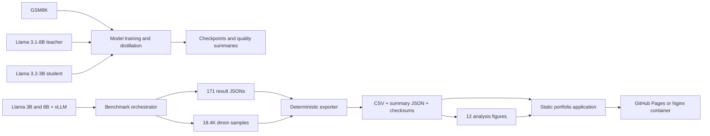

# Distill or Optimize? LLM Model and Runtime Optimization

A reproducible ML-systems study of two complementary ways to reduce large
language model inference cost:

1. **Model optimization** — cross-entropy fine-tuning, full-logit knowledge
   distillation, top-k distillation, hidden-state alignment, and sequence
   distillation from Llama 3.1-8B to Llama 3.2-3B on GSM8K.
2. **Runtime optimization** — continuous batching, chunked prefill, prefix
   caching, asynchronous scheduling, 4-bit quantization, and speculative
   decoding with vLLM on an NVIDIA H200.

The repository contains the experiment code, 171 raw benchmark results,
normalized data products, GPU telemetry, 12 reproducible figures, automated
tests, CI/security workflows, a containerized portfolio site, and the original
[project proposal](Group8-LLMOptimization.pdf).

> The strongest verified results are runtime results. Model-training workflows
> are implemented, but trained weights and GSM8K accuracy summaries are not in
> this repository; no model-quality improvement is claimed without that
> evidence.

## Headline results

| Scale or result | Verified value |
|---|---:|
| Models / serving variants | 2 / 10 |
| Model-variant combinations | 19 |
| Isolated benchmark runs | 171 |
| Completed requests / failures | 34,200 / 0 |
| Tokens processed | 22,218,600 |
| GPU telemetry samples | 18,435 across 21 fields |
| Peak achieved request throughput | 15.57 requests/s |
| Peak output throughput | 1,993.21 tokens/s |
| Peak total token throughput | 9,950.47 tokens/s |
| Reproducible figures | 12 |

At 16 offered requests/s on the 512-input/128-output workload:

- **Llama 3.1-8B:** vLLM default increased achieved throughput **11.79×**,
  from 1.28 to 15.07 requests/s, and reduced p99 end-to-end latency **99.23%**,
  from 142.39 seconds to 1.10 seconds, versus the serialized control.
- **Llama 3.2-3B:** continuous batching plus async scheduling sustained 15.38
  requests/s and 1,969 output tokens/s while reducing p99 end-to-end latency
  **125.77×**, from 87.45 seconds to 695 ms, versus the serialized control.
- **Parallel speculative decoding:** a parallel 1B draft reached the corpus
  peak of **15.57 requests/s and 1,993 output tokens/s** for Llama 3.1-8B.

The control uses `--max-num-seqs 1`; it serializes request execution but does
not remove every internal batching mechanism. The large tail-latency changes
primarily measure queueing avoidance, not a 100× kernel speedup.

See [results/README.md](results/README.md) for the full quantitative report,
paired medians, optimization tradeoffs, defensible resume bullets, and claims
that the stored evidence does not support.

## What this repository demonstrates

- GPU performance engineering across latency, throughput, concurrency, and
  saturation regimes.
- Teacher/student training with full-distribution, sparse top-k, hidden-state,
  and sequence-level distillation objectives.
- Reproducible experiment ETL from raw JSON and `nvidia-smi dmon` logs to CSV,
  aggregate JSON, checksums, figures, and a static public application.
- Correct causal-language-model loss alignment and robust GSM8K answer scoring,
  covered by unit tests.
- Production repository practices: packaging, linting, typing, tests, CI,
  CodeQL, Dependabot, secret-safe configuration, containerization, governance,
  and automated GitHub Pages deployment.
- Honest negative-result analysis: quantization and speculative decoding can
  worsen latency on fast hardware when their overhead exceeds their benefit.

## Architecture



The expensive GPU layer and the lightweight reporting layer are deliberately
separate. The public application requires no model weights, GPU, credential,
database, or writable backend. More detail is in
[docs/ARCHITECTURE.md](docs/ARCHITECTURE.md).

## Repository layout

```text
.
├── llm_optimization/              # tested shared prompt, scoring, and KD primitives
├── Model_Optimizations/
│   ├── configs/                     # portable CE/full-KD/top-k experiment YAMLs
│   ├── sanity_checks/               # gated-model and compatibility checks
│   ├── scripts/                     # H100/Slurm recipes and publishing utility
│   └── src/                         # training, trace generation, and evaluation
├── bench/
│   ├── bench.py                     # vLLM server/load orchestration
│   └── bench_results/               # versioned raw result and telemetry evidence
├── analysis/
│   ├── analyze_bench.py             # 12-figure analysis pipeline
│   ├── export_results.py            # deterministic result/telemetry exporter
│   └── utils.py                     # parsing and label normalization
├── results/                       # normalized CSV/JSON and SHA-256 checksums
├── figures/                       # generated performance visualizations
├── site/                          # dependency-free portfolio site source
├── scripts/build_site.py          # deterministic site assembler
├── tests/                         # correctness, exporter, and site integration tests
├── .github/                       # CI, CodeQL, Pages, Dependabot, templates
├── Dockerfile                     # multi-stage static-site image
├── pyproject.toml                 # package metadata and tool configuration
└── Group8-LLMOptimization.pdf     # original five-page proposal
```

Large checkpoints, Hugging Face caches, secrets, transient logs, and local
virtual environments are intentionally excluded from version control.

## Quick start

The analysis, tests, and public site work on ordinary Python 3.10–3.12 systems.
GPU training and vLLM benchmarking require a separate Linux/NVIDIA environment.

```bash
python3 -m venv .venv
source .venv/bin/activate
python -m pip install --upgrade pip
python -m pip install -e '.[analysis,test,dev]'

make check
```

`make check` runs linting, type checking, tests, deterministic result export,
and the static-site build. Install PyTorch to exercise the KD-loss tests
locally:

```bash
python -m pip install 'torch>=2.7,<3'
python -m pytest --cov=llm_optimization --cov-fail-under=90
```

Available commands:

| Command | Purpose |
|---|---|
| `make lint` | Ruff static analysis |
| `make typecheck` | mypy checks for production modules |
| `make test` | unit and integration tests |
| `make export` | rebuild normalized results and checksums |
| `make figures` | regenerate all 12 figures |
| `make site` | build the deployable site in `dist/` |
| `make serve` | serve the site at `http://localhost:8000` |
| `make docker-build` | build the Nginx production image |

## Public results application

Build and preview locally:

```bash
python scripts/build_site.py --output-dir dist
python -m http.server 8000 --directory dist
```

Open `http://localhost:8000`. The build copies only public, versioned assets:
the site, aggregate JSON, two downloadable CSVs, all figures, and the proposal.

Container deployment:

```bash
docker build -t llm-optimization-portfolio .
docker run --rm -p 8080:8080 llm-optimization-portfolio
```

The final image uses unprivileged Nginx on port 8080, includes a health check,
and sends CSP, clickjacking, MIME-sniffing, referrer, and permissions headers.
The GitHub Pages workflow builds the same `dist/` artifact on every push to
`main` and deploys it without repository secrets.

## Runtime benchmark design

### Reproduced environment

Every checked-in run reports:

| Component | Version |
|---|---|
| GPU | NVIDIA H200, one device |
| Python | 3.12.5 |
| PyTorch | 2.10.0+cu126 |
| CUDA | 12.6 |
| vLLM | 0.18.0 |

### Workload matrix

Each model/variant combination contains 200 random prompts at each of nine
points:

| Purpose | Input tokens | Output tokens | Offered load |
|---|---:|---:|---:|
| Short / short | 128 | 128 | 2 requests/s |
| Long / short | 768 | 32 | 2 requests/s |
| Short / long | 128 | 512 | 2 requests/s |
| Long / long | 768 | 192 | 2 requests/s |
| QPS sweep | 512 | 128 | 1, 2, 4, 8, 16 requests/s |

The harness records request, input-token, output-token, and total-token
throughput; mean, p50, p95, and p99 TTFT, TPOT, ITL, and end-to-end latency;
server/client logs; and one-second NVIDIA telemetry.

### Serving variants

| Label | Effective configuration |
|---|---|
| `no-opts` | Serialized control: selected optimizations disabled, `--max-num-seqs 1` |
| `cb` | Continuous batching |
| `cb+cp` | Continuous batching + chunked prefill |
| `cb+pc` | Continuous batching + prefix caching |
| `cb+as` | Continuous batching + async scheduling |
| `default` | vLLM default optimization set |
| `all+q` | Default + BitsAndBytes 4-bit quantization |
| `all+sd(1B)` | Default + 1B PARD speculative draft |
| `all+sd(1B+p)` | Default + parallel 1B draft |
| `all+sd(3B)` | Default + 3B draft for the 8B target |

### Run the harness

Use a dedicated Linux/CUDA system and obtain access to the gated Meta models.
Pass credentials only through the environment:

```bash
cd bench
source module.sh       # only on a compatible modules/HPC system
source init.sh         # creates bench/.venv on first run
export HF_TOKEN='hf_...'
source env.sh
source install.sh
python sanity_check.py

python bench.py \
  meta-llama/Llama-3.2-3B \
  'NVIDIA H200' \
  vllm-0.18.0-default \
  > bench.out 2> bench.err
```

Arguments after a standalone `--` pass directly to `vllm serve`. Each scenario
restarts the server and writes results under:

```text
bench/bench_results/<model>/<gpu>/<variant>/
├── env.txt
├── result/       # JSON metrics: versioned source of truth
├── mon/          # nvidia-smi dmon telemetry: versioned source evidence
├── bench_log/    # verbose transient logs; ignored for new runs
└── serve_log/    # verbose transient logs; ignored for new runs
```

## Runtime analysis

Rebuild the compact data layer from raw evidence:

```bash
python analysis/export_results.py \
  --bench-dir bench/bench_results \
  --output-dir results

cd results
shasum -a 256 -c CHECKSUMS.sha256
```

Outputs:

- `benchmark_results.csv`: one normalized row per result JSON.
- `gpu_telemetry_summary.csv`: one aggregate row per dmon log.
- `summary.json`: scale, peaks, paired medians, high-load results, and caveats.
- `CHECKSUMS.sha256`: integrity hashes for every generated data product.

Rebuild figures:

```bash
python analysis/analyze_bench.py \
  --bench-dir bench/bench_results \
  --out-dir figures
```

The analysis covers tail latency versus workload and QPS, improvement heatmaps,
quantization and speculation deltas, 3B-versus-8B comparisons, and efficiency
frontiers. Representative outputs include:

- [all-metric improvement heatmap](figures/improvement_summary_heatmap_all.png)
- [tail latency QPS grid](figures/tail_latency_qps_grid_2x2_best.png)
- [student/teacher speedup heatmap](figures/student_vs_teacher_speedup_heatmap.png)
- [throughput/latency efficiency frontier](figures/efficiency_frontier_qps_sweep_logy.png)

## Runtime findings

1. **Batching dominates the serialized control.** Across nine paired workload
   points, vLLM default improved median output throughput 1.51× for 3B and
   2.33× for 8B. Median p99 end-to-end reductions were 96.4% and 99.1%.
2. **Default vLLM is a strong baseline.** It is consistently competitive, but
   `cb+as` avoided a 3B p99 tail spike at the highest offered load.
3. **Quantization was not a latency win on H200.** BitsAndBytes 4-bit inference
   worsened median p99 end-to-end latency 122% for 3B and 158% for 8B versus
   default, while output throughput fell slightly.
4. **Speculation is configuration-sensitive.** Parallel 1B drafting improved
   8B median p99 end-to-end latency 8.5% but worsened it 36% for the 3B target.
5. **Smaller models primarily improved latency at these loads.** Under paired
   default runs, 3B reduced median p99 end-to-end latency 36.7% and p99 TPOT
   37.6% relative to 8B, while throughput differed by only 0.4% because most
   optimized points were offered-load-bound.

These are descriptive single-run measurements, not confidence intervals or
hardware-general claims.

## Model optimization

Run model commands from `Model_Optimizations/` so its historical `src` package
resolves consistently.

### Implemented workflows

| Workflow | Entrypoint | Output |
|---|---|---|
| Config-driven CE/full-KD/top-k KD | `python -m src.train --config ...` | logs and best/final checkpoint |
| Hugging Face CE fine-tuning | `python -m src.train_hf_ce` | checkpoints and `final/` |
| Full/top-k/hidden KD | `python -m src.train_hf_kd` | checkpoints and `final/` |
| Teacher-trace generation | `python -m src.generate_seqdistill_dataset` | all/correct-only JSONL |
| Sequence distillation | `python -m src.train_hf_seqdistill` | checkpoints and `final/` |
| Config-driven evaluation | `python -m src.evaluate --config ...` | predictions and summary JSON |
| Completion-only HF evaluation | `python -m src.evaluate_hf_relaxed` | predictions and summary JSON |

### Correctness hardening

The production pass addressed the major risks discovered in the initial audit:

- one canonical real-newline GSM8K prompt shared by training, trace generation,
  and HF evaluation;
- completion-only decoding and scoring, preventing numbers in the prompt from
  contaminating predictions;
- robust numeric normalization for comma-formatted values, currency, boxed
  answers, scientific notation, finite fractions, and configurable tolerance;
- causal-shifted full and top-k KL losses aligned with next-token prediction;
- validated temperature/top-k/masking edge cases and all-masked batches;
- train-derived validation for checkpoint selection, reserving the official
  GSM8K test split for final evaluation;
- reversible Boolean CLI options and explicit hyperparameter validation;
- correct legacy loss logging under gradient accumulation, configured periodic
  saves, and a final checkpoint;
- portable relative output directories and a single extras-based dependency
  definition.

The shared implementations live in `llm_optimization/` and are covered by the
unit suite. The legacy research entry points remain under
`Model_Optimizations/src/` for experiment reproducibility.

### Objectives

- **CE:** causal language-model cross entropy on gold solution tokens.
- **Full KD:** temperature-scaled KL divergence over the shared vocabulary.
- **Top-k KD:** KL divergence on the teacher's top-k distribution, reducing
  memory and distributional work.
- **Hidden alignment:** MSE between selected student and teacher hidden states,
  with a learned projection when dimensions differ.
- **Sequence distillation:** CE on teacher-generated solutions, optionally
  filtered by numeric correctness and mixed with gold traces.

The legacy config's `kd_alpha` is the KD weight. The HF trainer's `--alpha` is
the CE weight. This convention difference is preserved for compatibility and
documented here to prevent experiment inversion.

### Environment and examples

Install the GPU training extra in a compatible Linux/CUDA environment:

```bash
python -m pip install -e '.[training]'
export HF_TOKEN='hf_...'
cd Model_Optimizations
```

CE baseline:

```bash
python -m src.train_hf_ce \
  --model_name meta-llama/Llama-3.2-3B \
  --output_dir outputs/hf_student_ce \
  --num_train_epochs 10 \
  --per_device_train_batch_size 2 \
  --gradient_accumulation_steps 8 \
  --learning_rate 1e-5 \
  --max_seq_length 1024
```

Top-k KD:

```bash
python -m src.train_hf_kd \
  --student_model meta-llama/Llama-3.2-3B \
  --teacher_model /path/to/teacher/final \
  --output_dir outputs/hf_topk_kd \
  --kd_method topk \
  --top_k 64 \
  --alpha 0.7 \
  --temperature 2.0 \
  --kd_on_answer_only \
  --num_train_epochs 10 \
  --max_seq_length 1024
```

The populated YAML configs are portable. Slurm launchers preserve the original
Georgia Tech PACE experiment matrix and still contain cluster-specific
partitions, module/Conda paths, and log paths; treat them as historical recipes
and adapt them before submission on another cluster.

### Model-evidence boundary

No trained checkpoint, `test_summary.json`, or consolidated quality table is
included. Therefore this repository does **not** substantiate:

- a GSM8K accuracy or accuracy improvement;
- teacher-quality retention after distillation;
- a quality/latency Pareto frontier for the distilled checkpoint;
- a claim that the runtime speedups were measured on distilled weights.

Future model runs should store lightweight `run_config.json` and
`test_summary.json` artifacts containing checkpoint ID, dataset/split, seed,
prompt version, decoding settings, exact match, extraction failures, training
time, and peak memory. Keep weights in Hugging Face Hub or approved artifact
storage, not Git.

## Verification and automation

Local validation:

```bash
make lint
make typecheck
python -m pytest --cov=llm_optimization --cov-fail-under=90
python -m compileall -q llm_optimization Model_Optimizations/src analysis scripts tests
node --check site/app.js
```

The test suite covers prompt consistency, numeric parsing, tolerance semantics,
causal KD shifting, masking and validation, deterministic export/checksum
generation, and complete static-site assembly.

GitHub automation includes:

- Python 3.10 and 3.12 lint/type/test/build jobs;
- a separate CPU-PyTorch loss test with a 90% coverage floor;
- deterministic result regeneration and diffing;
- shell/Slurm syntax and Python compilation checks;
- a multi-stage container build;
- CodeQL scanning and Dependabot updates;
- artifact upload and GitHub Pages deployment.

GPU model training and vLLM serving are intentionally not run in hosted CI
because they require gated weights and NVIDIA hardware.

## Limitations and next experiments

- One run exists per runtime point; repeat 3–5 times, randomize order, and
  report bootstrap or run-level intervals.
- Requests use synthetic random tokens rather than production, conversation, or
  GSM8K traces; add realistic length and shared-prefix distributions.
- The serialized control exaggerates queueing relative to optimized concurrent
  serving; describe it precisely in every external claim.
- The runtime corpus uses base 3B/8B weights; benchmark the CE and best
  distilled 3B checkpoints to connect quality with latency and throughput.
- Peak telemetry fields are useful operational bounds, but power/energy
  comparisons require time-aligned integration and repeated runs.
- Results come from one H200; repeat on A100/H100 and report hardware-specific
  conclusions.

## Responsible resume use

The [stored-results report](results/README.md) contains resume-ready bullets and
all supporting numbers. Claim only the components you personally contributed
to. For shared team work, use language such as `co-developed`, `contributed
to`, or `led the <specific component>`.

Do not represent synthetic benchmarks as production traffic, a serialized
baseline as total batching removal, single runs as statistically significant,
or unrecorded model accuracy as measured fact.

## Contributing, security, and citation

- Contribution workflow: [CONTRIBUTING.md](CONTRIBUTING.md)
- Security and credential reporting: [SECURITY.md](SECURITY.md)
- Community expectations: [CODE_OF_CONDUCT.md](CODE_OF_CONDUCT.md)
- Citation metadata: [CITATION.cff](CITATION.cff)

Never commit Hugging Face tokens, model weights, caches, private data, or
cluster credentials. Copy `.env.example` to a local ignored `.env` only if your
tooling loads it explicitly.

## Team and license

Georgia Tech CS 4675/6675 Group 8: Ramanathan Swaminathan, Mika Okamoto, Hardik
Jhunjhunwala, Chengsong Diao, and Erenay Daylak.

Repository code and documentation are released under the [MIT License](LICENSE).
Meta Llama weights and the GSM8K dataset retain their own licenses and access
conditions; the MIT license does not relicense third-party models or data.
